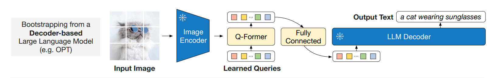

# V-JEPA 2 Video Captioning

A proof-of-concept implementation of BLIP-2's vision-language alignment method adapted for video captioning. This project demonstrates how a frozen vision encoder (V-JEPA 2) and frozen language model (Qwen2-1.5B) can be efficiently aligned using a lightweight Q-Former module trained on the Something-Something-V2 dataset.

<div style="display: grid; grid-template-columns: repeat(2, 1fr); gap: 20px; justify-items: center; align-items: center; margin: 0 auto; max-width: 800px;">
  <div style="text-align: center;">
    
  </div>
  <div style="text-align: center;">
    
  </div>
  <div style="text-align: center;">
    
  </div>
  <div style="text-align: center;">
    
  </div>
</div>

## Overview

This approach:
- Uses Meta's V-JEPA 2 as the frozen vision encoder
- Uses Qwen2-1.5B as the frozen language model
- Trains only a Q-Former module (~40M parameters) to bridge vision and language modalities
- Achieves strong video captioning results with minimal trainable parameters

The key insight from BLIP-2 is that by keeping both the vision and language models frozen, we can learn an efficient alignment with far fewer parameters and compute than end-to-end training.

## Methodology


*Architecture diagram from adapted from [BLIP-2: Bootstrapping Language-Image Pre-training with Frozen Image Encoders and Large Language Models](https://arxiv.org/pdf/2301.12597)*

This project adapts the BLIP-2 architecture for video captioning. The key adaptation is **replacing single image input with 32-frame video sequences**:

1. **Video Encoder (Frozen)**: Instead of processing a single image through a frozen image encoder, we process 32-frame video clips through V-JEPA 2, Meta's video understanding model. This produces spatiotemporal features that capture both appearance and motion.

2. **Q-Former (Trainable)**: The Q-Former module remains the core trainable component. It uses learned queries to extract the most relevant visual information from the video features, compressing the 32-frame sequence into a fixed set of query embeddings that bridge the vision and language modalities.

3. **LLM Decoder (Frozen)**: The Q-Former outputs are fed into a frozen Qwen2-1.5B language model, which generates natural language captions describing the video content.

By keeping both the video encoder and language model frozen, we only need to train the lightweight Q-Former (~40M parameters) to learn the vision-language alignment. This makes the approach highly parameter-efficient while leveraging the strong representations from both pretrained models.

## Installation

```bash
uv sync
# or
pip install -e .
```

## Dataset Preparation

### 1. Download Something-Something-V2

Download the Something-Something-V2 dataset from [the official website](https://developer.qualcomm.com/software/ai-datasets/something-something).

### 2. Preprocess Video Features (Recommended)

Since V-JEPA 2 is frozen during training, precompute the features to avoid loading the vision model in VRAM and speed up training:

```bash
python preprocess_something_something_v2.py
```

Update the paths in the script to point to your dataset location. This will extract V-JEPA features for all videos and save them as `.pt` files.

### 3. Download Paraphrase Augmentations

Download the paraphrase augmentations from [somethingsomethingv2-paraphrase](https://github.com/stevebottos/somethingsomethingv2-paraphrase) and save as `ssv2_paraphrase.json` in the project root.

This provides additional language variation for training samples, exposing the model to more diverse captions and improving generalization.

### 4. Prepare Annotations

Process the annotations to format all captions as lists:

```bash
python prepare_annotations.py
```

This converts captions to list format (validation will have lists of length 1, training will include paraphrases) and simplifies random caption selection in the dataloader.

## Training

```bash
python train.py
```

The model typically converges after 8-10 epochs. Training only the Q-Former (~4M parameters) while keeping V-JEPA and Qwen2 frozen makes this very efficient.

Configuration:
- Batch size: 8
- Gradient accumulation: 16 steps
- Learning rate: 5e-5
- Weight decay: 0.03

The script will:
- Save checkpoints to `checkpoint.pt` after each epoch
- Log losses to `losses.txt`
- Save validation predictions to `results/validation_epoch_N.json`

## Evaluation

Run full evaluation with standard captioning metrics:

```bash
python evaluate.py
```

This computes BLEU, METEOR, ROUGE-L, and CIDEr scores on the validation set... Caveat: CIDEr is the only one that I think is loosely worth paying attention to, since the validation set is not really designed for captioning. Validation "captions" for SSV2 are not really "human-like".

## Inference

Generate captions for test set samples:

```bash
python infer.py --num-samples 10 --checkpoint checkpoint.pt
```

Results are saved to `results/` with both the generated captions and source videos.
